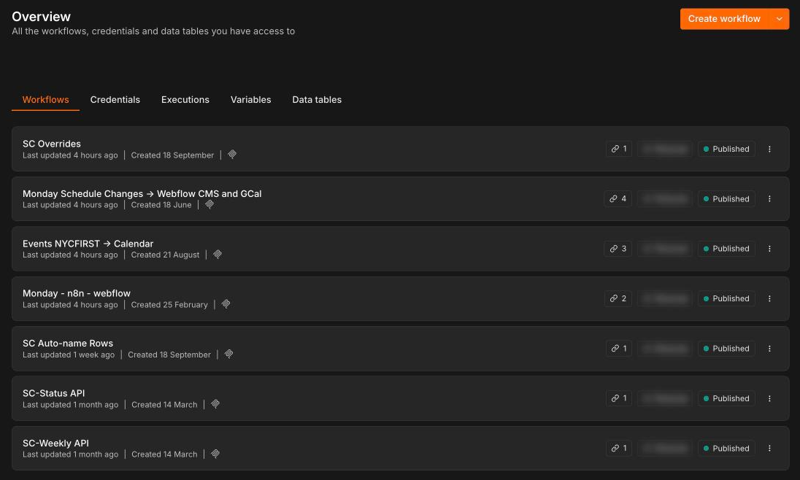
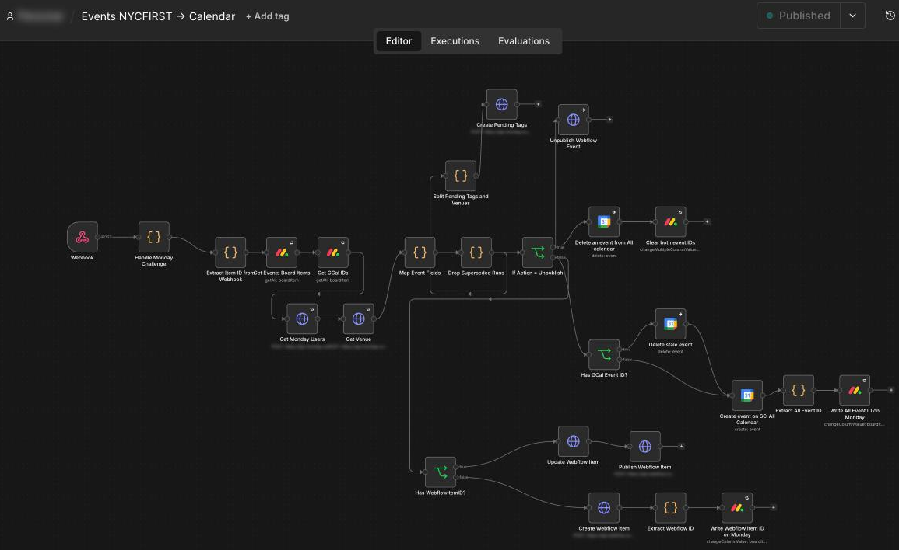
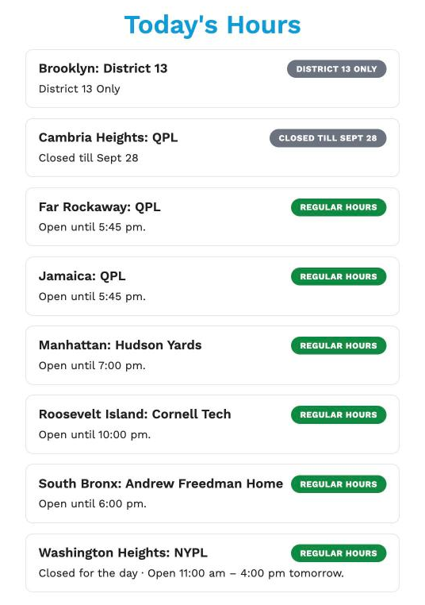
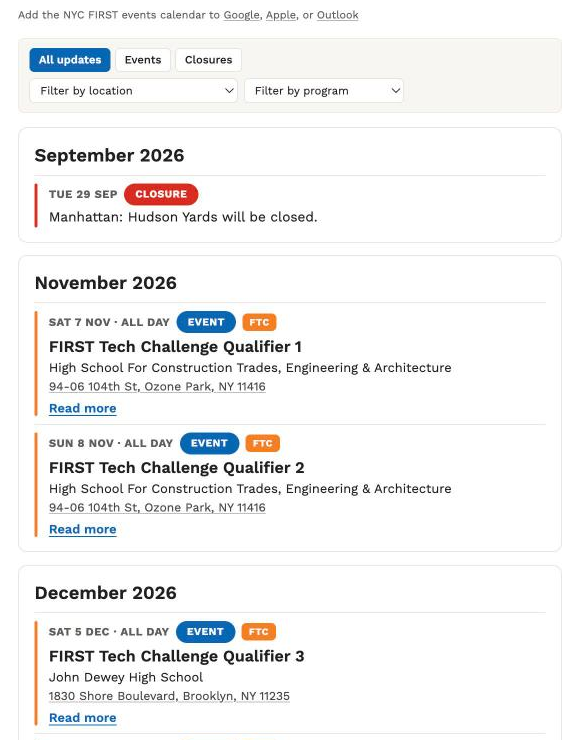

# NYC FIRST STEM Center Schedule System

A staff-managed system for publishing NYC FIRST STEM Center hours, closures, schedule changes and events to the website and Google Calendar.

Launched September 25, 2026.

This repository contains the public front-end and deployment code for the larger system. The full system connects Monday.com, n8n, Webflow, Google Calendar and nycfirst.org.


*Left: the Webflow CMS collection, filled automatically from Monday.com through n8n. Right: the public events page built from it.*

## What I built

The project started in November 2025 with a simple question: how can someone tell whether a STEM Center is actually open today?

It developed into a system where staff can submit and manage schedule information in Monday.com and publish it to the places where people need it without separately maintaining Webflow and Google Calendar.

The system now includes:

- Monday.com forms and boards for events, closures, alternate hours and regular STEM Center hours
- a self-hosted NYC FIRST n8n instance, now also used by other staff for internal automation
- seven documented production workflows for publishing, synchronization and live schedule feeds
- automated publishing from Monday.com to Webflow
- automated event publishing to Google Calendar
- shared and center-specific calendars
- Webflow CMS integration
- public Today's Hours and Upcoming Events interfaces
- event filtering and calendar subscription
- configuration boards for calendars, programs, colors and venues
- Cloudflare Pages deployment for the front-end code

## How it works

```text
Staff
  │
  │ Monday forms / board edits
  ▼
Monday.com
  │
  │ webhooks
  ▼
n8n
  ├────────► Webflow CMS ────────► nycfirst.org
  │
  ├────────► Google Calendar
  │
  ├────────► IDs back to Monday
  │
  └────────► Public schedule feeds
                                  │
                                  ▼
                    schedule.js / schedule.css
                    hosted on Cloudflare Pages
```

Monday.com is the operational source of truth.

Staff submit events and schedule changes through forms. Publishers review the records and control whether they are public using a publish-status field.

n8n handles the authenticated work between systems. It publishes and updates Webflow items and Google Calendar events, then writes their IDs back to Monday so later edits continue updating the same records.

Webflow provides the CMS and page structure.

This repository provides the browser-side presentation layer used for Today's Hours, Upcoming Events, event filtering and calendar subscription.



*The seven production workflows on NYC FIRST's self-hosted n8n instance.*



*The main Events workflow: Monday change → Webflow and Google Calendar → IDs written back to Monday.*

## Staff workflow

A typical event moves through the system like this:

```text
Submit event
    ↓
Review in Monday.com
    ↓
Set Published
    ↓
n8n processes the event
    ├── Webflow
    └── Google Calendar
    ↓
Webflow + Calendar IDs written back to Monday
    ↓
Future edits update the existing records
```

Staff do not need to edit the same event separately in Webflow or Google Calendar.

<p>
  
</p>

*Most staff start with a Monday.com form. A submission stays internal until a publisher sets it to Published.*


*The Events board. The last two columns are the Google Calendar and Webflow IDs n8n writes back (values blurred).*


*Published events land on the shared calendar, alongside the center-specific calendars.*

Closures and alternate hours follow a similar process for the website (they are not currently sent to Google Calendar) and are also exposed through a public read-only n8n feed so Today's Hours can reflect current schedule changes.


*Exceptions (top) and regular weekly hours (bottom) are maintained separately in Monday.com.*

## Public interface

The front-end code in this repository provides:

<p>
  
  
</p>

*Today's Hours and the events page on nycfirst.org.*

### Today's Hours

- Current open / closed / alternate-hours status
- Next opening time
- Multi-day closures
- Center-page links
- New York timezone handling

### Upcoming Events

- Events, closures and alternate hours
- Multi-day dates
- Registration links
- Off-site venues and map links
- Program tags and program-specific colors
- Expandable descriptions

### Events and calendar

- Filters for update type, location and program
- Shareable filtered URLs
- Google Calendar, Apple Calendar and Outlook subscription options

## System documentation

The repository contains additional documentation for the parts of the system that do not live in this codebase:

- [Architecture](docs/architecture.md)
- [Automation workflows](docs/workflows.md)
- [Monday.com data model](docs/monday-data-model.md)
- [Reliability and production lessons](docs/reliability.md)

Raw n8n workflow exports, credentials, private webhook URLs and private identifiers are intentionally not stored here. The only n8n address in the code is the public read-only closures feed the browser reads.

## Repository files

| File | Purpose |
| --- | --- |
| `schedule.js` | Builds the public schedule interfaces from Webflow markup and live schedule data |
| `schedule.css` | Styles the schedule and event components |
| `deploy.sh` | Commits, deploys to Cloudflare Pages and verifies the live files |
| `package.json` | Development dependency configuration for Cloudflare Wrangler |
| `package-lock.json` | Locks deployment dependencies |
| `RELEASE_NOTES.md` | Release history |
| `docs/` | Architecture and system documentation |

## Webflow integration

Load the stylesheet in the page `<head>`:

```html
<link rel="stylesheet" href="https://schedule.nycfirst.org/schedule.css">
```

Load the JavaScript before `</body>`:

```html
<script src="https://schedule.nycfirst.org/schedule.js"></script>
```

Optional Webflow classes:

| Class | Purpose |
| --- | --- |
| `sc-center` | Centers a schedule block |
| `sc-teaser` | Shows the short Upcoming list |
| `sc-filters` | Enables filters and calendar subscription |
| `sc-panel` | Adds a solid background to content over imagery |

## Development and deployment

Install the pinned Cloudflare deployment dependency once:

```bash
npm install
npx wrangler login
```

After editing `schedule.js`, `schedule.css`, or the documentation:

```bash
./deploy.sh "what changed"
```

The deployment script:

1. Adds a build stamp.
2. Commits and pushes the project to GitHub.
3. Copies only the production CSS and JavaScript into the deployment directory.
4. Deploys those files to Cloudflare Pages.
5. Verifies that schedule.nycfirst.org is serving the new build.

## Security

This is a public repository.

No Monday.com, n8n, Webflow or Google credentials belong here. Authenticated operations are handled inside n8n's credential store.

Private webhook URLs, board IDs, staff information and raw workflow exports are intentionally excluded. The public closures feed and the public calendar ID in `schedule.js` are meant to be read by browsers.

## Project history

The first prototype was created in November–December 2025 as a page answering "Is the STEM Center open?"

Over the following ten months the system expanded to include weekly hours, live schedule changes, events, Google Calendar publishing, configuration boards, filtering and a dedicated front-end deployment.

The production system launched September 25, 2026.

Earlier versions of the front-end were served through jsDelivr. The production files are now deployed through Cloudflare Pages at `schedule.nycfirst.org`.
