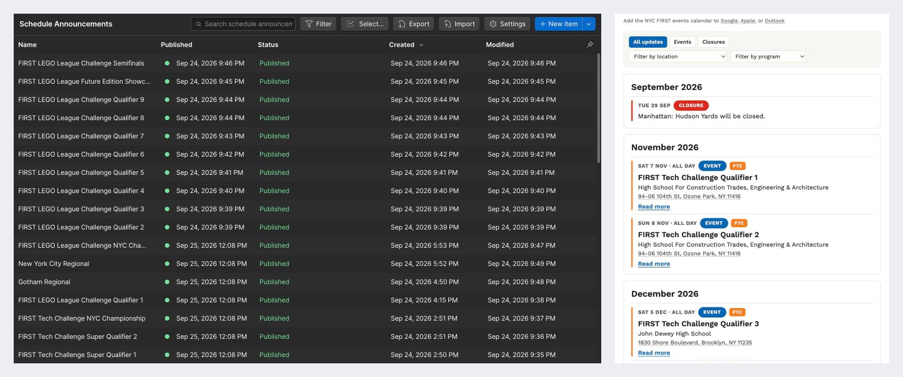
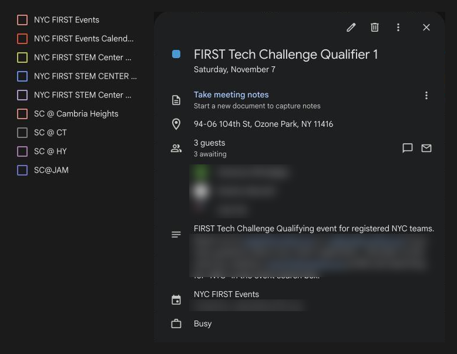

# Architecture

How the NYC FIRST Schedule & Events System fits together: where data is entered, where it lives, how it moves, and where it appears.

Items marked **⚠ Needs verification** have not been confirmed against the live configuration.

## Overview

```
Staff
  │  Monday forms (most submissions)  or  direct board edits (publishers)
  ▼
Monday.com boards ─────────────── source of truth
  │  webhooks on item changes
  ▼
n8n  (self-hosted, n8n.nycfirst.org)
  ├──► Webflow CMS ──────────────► nycfirst.org pages
  ├──► Google Calendar ──────────► SC-All calendar, center calendars invited
  ├──► IDs written back to Monday
  └──► public read-only JSON feeds ◄── read by the browser
                                          │
nycfirst.org ◄── schedule.js / schedule.css (this repo, served from schedule.nycfirst.org)
```

| Layer | Responsibility |
| --- | --- |
| Monday forms | Intake. Staff submit events and schedule changes without opening the boards. |
| Monday.com boards | Source of truth for STEM Center hours and schedule changes, NYC FIRST events, and shared configuration such as calendars, programs, tags and venues. Publishing is controlled by a status column. |
| n8n | Listens for Monday changes, writes to Webflow and Google Calendar, writes the resulting IDs back to Monday, and serves public read-only feeds. |
| Webflow CMS | Public content and page layer. Holds a copy of what Monday says; it is not edited as a source. |
| Google Calendar | Distribution. One shared SC-All calendar, plus a calendar per STEM Center. |
| Front end (this repo) | Presentation: Today's Hours, Upcoming, events-page filters, subscribe links. |
| Cloudflare Pages | Hosts `schedule.js` and `schedule.css`. |

## Publishing paths

| Data | Path | Public output |
| --- | --- | --- |
| Events | Form or board → Published → n8n → Webflow and Google Calendar | Upcoming lists, events page, calendars |
| Closures and alternate hours | Form or board → Published → n8n → Webflow; also served live by the SC Overrides feed | Upcoming lists, Today's Hours |
| Regular weekly hours | STEM Center Hours board → n8n → Webflow STEM Center item | Card Holder Walk-in Hours on `/stem-centers`; baseline for Today's Hours |

**Regular weekly hours** have their own path:

- They are stored on the STEM Center Hours board in Monday.com, one row per center.
- Changing one day's hours triggers n8n. There is no publish step.
- n8n updates that day's field on the center's Webflow STEM Center item, found by the Webflow ID stored on the row.
- Webflow renders those values as "Card Holder Walk-in Hours" on each center card at `/stem-centers`. `schedule.js` is not involved.
- The same regular hours are the baseline schedule Today's Hours starts from.

Closures and alternate hours are different: Today's Hours reads them live from the SC Overrides feed and applies them on top of that baseline.

## The n8n instance

NYC FIRST runs a self-hosted n8n instance at n8n.nycfirst.org. It was launched for this project and is now used by multiple NYC FIRST staff for other internal automations. This system's workflows are one set among several on that instance.

The production workflows keep Webflow, Google Calendar and Monday.com authentication in n8n's credential store. The browser never talks to Monday, Webflow's API or Google Calendar directly.



*Webflow is the public CMS and page layer. Items arrive from Monday.com through n8n and appear on the site.*



*Each published event is created once on the shared SC-All calendar.*

## Design decisions

These are the choices that shape how the system behaves.

**Monday is the only place data is edited.** Webflow and Google Calendar receive copies. When a copy is created, n8n writes its ID back to the Monday row. Later edits to that row update the same Webflow item and calendar event instead of creating new ones.

**Forms are the main intake.** Most staff interact with the system through Monday forms for events and schedule changes, not by editing boards. The boards are where publishers review, correct and publish.

**Publishing is an explicit status.** A row can exist without appearing anywhere. Setting the publish status to Published pushes it out; setting it to Unpublished removes it from the live site and calendar.

**One event, many calendars.** Each published event is created once, on the shared SC-All calendar. The relevant STEM Center calendars and tagged staff are added as attendees, so every calendar shows the same event record.

**Events are not tied to STEM Centers.** An event may be at a STEM Center, a school, a partner site or another venue, or be organization-wide. Off-site locations are stored as reusable Venue records on the Venues board rather than recreated for every event. An event can link a Venue; if the venue is not listed yet, staff type its name and address, the event still publishes, and n8n adds the new venue to the Venues board for review. Venues are part of the Monday.com data model and the Events workflow, not a front-end feature; `schedule.js` only displays the venue name, address and map link that Webflow renders.

**Configuration lives in Monday.** The Calendars board maps each center to its calendar and staff; the Tags board holds program names and colors; the Venues board holds off-site locations. Adding a center calendar, program or venue does not require editing a workflow. (Some mappings are still hardcoded in workflow code; see [reliability.md](reliability.md).)

**Loop guard.** Writing an ID back to Monday fires another Monday webhook. The Events workflow recognizes changes to the columns it writes itself and ignores them.

**Live data for things that change daily.** Closures and alternate hours are read by the browser from a public n8n feed, so a Webflow display setting cannot hide a closure. If the feed is unreachable, the page falls back to the rows Webflow rendered.

## Roles

Final permissions are still being worked out.

| Role | What they do |
| --- | --- |
| Staff / submitters | Submit events and schedule changes, usually through Monday forms. |
| Managers / publishers | Review and publish items, and manage regular STEM Center hours. Which staff receive this access is still being finalized. |
| Technical maintainer | Maintains the n8n workflows, Webflow integration, this repository and its deployment. |

System-generated fields, such as Webflow and Google Calendar IDs, should not be edited by hand.

## Evolution

- **Nov–Dec 2025:** first "Is the STEM Center open?" prototype.
- **Feb–Mar 2026:** Monday → Webflow weekly hours automation and live status feeds.
- **Jun 2026:** schedule changes and closures.
- **Aug 2026:** event publishing and Google Calendar integration.
- **Aug–Sep 2026:** dedicated front-end repository, tags, venues, filtering and calendar subscriptions.
- **Sept 25, 2026:** production launch.

An earlier events path through Eventbrite (spring 2026) was replaced by the Monday-based Events workflow. See [workflows.md](workflows.md#legacy--maintenance-workflows).

## See also

- [workflows.md](workflows.md): each production workflow
- [monday-data-model.md](monday-data-model.md): boards, forms and columns
- [reliability.md](reliability.md): what is in place, the Sept 24 incident, and planned work
