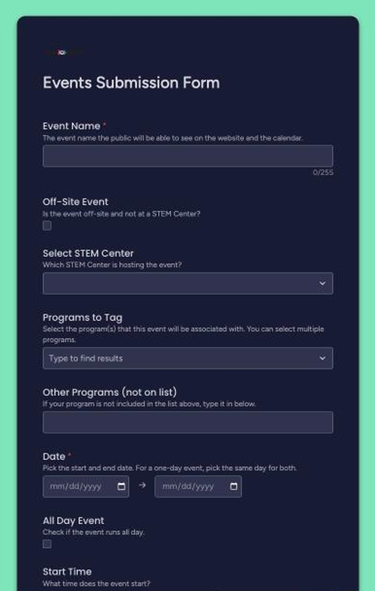
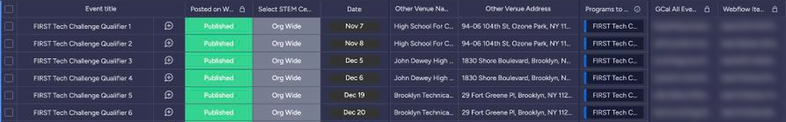
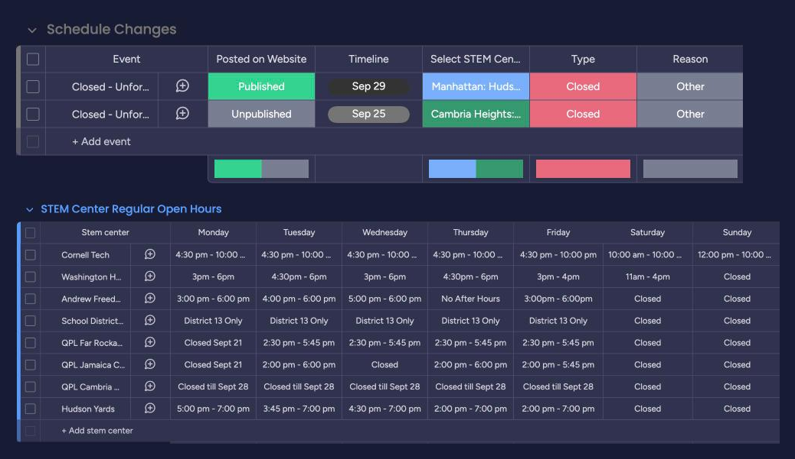

# Monday.com data model

Monday.com is the source of truth. This page describes the boards by purpose and column role. Board IDs, column IDs, user IDs and board contents are intentionally not listed.

Column names below describe each column's role. The workflows reference columns by internal ID, so exact titles on the boards may differ. ⚠ Needs verification against the live boards.

## How data gets in

| Path | Who | Used for |
| --- | --- | --- |
| Events form | Staff / submitters | Submitting events |
| Schedule Changes form | Staff / submitters | Submitting closures and alternate hours |
| Direct board edits | Managers / publishers | Review, corrections, publishing, weekly hours |

Many staff only ever see the forms. A form submission creates a row that is not public until a publisher sets it to Published.

## Operational boards

### Events

One row per event.

*System ID columns (right) are blurred.*

| Column role | Notes |
| --- | --- |
| Name | Event title |
| STEM Center | Host center, or Org Wide |
| Timeline | Start and end dates (older rows may use separate date columns) |
| Start / end hour | Blank for all-day events |
| Description, registration link | Shown on the site when set |
| Program | Links to the Tags board; controls the color stripe and program filter |
| Other tags | Free text; unknown tags are sent to Tags → pending |
| Venue | Links to the Venues board; free-text venue name and address for new ones |
| Image | Copied into Webflow |
| Volunteer opportunity | Checkbox |
| Staff | Invited to the calendar event |
| Posted on Website | Publish status: **Published** / **Unpublished** |
| Webflow ID | System field, written by n8n |
| Calendar event ID | System field, written by n8n |

### Schedule Changes

One row per closure or alternate-hours period.

| Column role | Notes |
| --- | --- |
| Name | Generated automatically (`Type - Reason - Center - Date`) |
| STEM Center | Affected center |
| Timeline | Date range; end date inclusive |
| Type | Kind of change, e.g. closure or alternate hours |
| Opens / Closes | Alternate hours, when the type needs them |
| Reason | "Other" is shown publicly as "Unforeseen Circumstances" |
| Staff | People associated with the change |
| Posted | Publish status: **Published** / **Unpublished** |
| Webflow Item ID | System field, written by n8n |
| Calendar event IDs | System fields; unused while the calendar step is disconnected |

### STEM Center Hours

One row per center. The row name is the center's short code.

| Column role | Notes |
| --- | --- |
| Full center name, location, address | Used by the public feeds |
| Monday … Sunday | Regular hours as text; blank means closed |
| Webflow Item ID | System field linking the row to its Webflow item |

Managed by publishers. Editing a day's hours updates the matching Webflow item automatically.

## Configuration boards

Reference data read by the workflows. Changing a row changes system behavior without editing a workflow.

| Board | Holds | Maintenance |
| --- | --- | --- |
| Calendars | One row per center code, plus "All" and Org Wide: the center's Google Calendar, staff to invite, address | Configuration / reference data |
| Tags | Program code, full name and color | New tags arrive in a pending group; review is manual |
| Venues | Off-site venue names and addresses | New venues arrive in a pending group; review is manual |

There is no automated approval step for Tags or Venues. The Events workflow only adds unknown entries to the pending group.

Tag colors reach the page as `CODE=#hex=Name` entries, which `schedule.js` reads to color the program stripes.

## Publish status

| Value | Effect |
| --- | --- |
| Published | Created or updated on the website (and, for events, on Google Calendar) |
| Unpublished | Removed from the live website (and, for events, from Google Calendar) |
| Empty | Nothing happens; the row stays internal |

## System fields

Webflow IDs and calendar event IDs are written by n8n and link a Monday row to its copies. They should not be edited by hand.

Duplicating a row in Monday also copies these IDs, so the copy would point at the original's Webflow item and calendar event. Clear them on a duplicated row before publishing it. Protection against this is planned; see [reliability.md](reliability.md).
